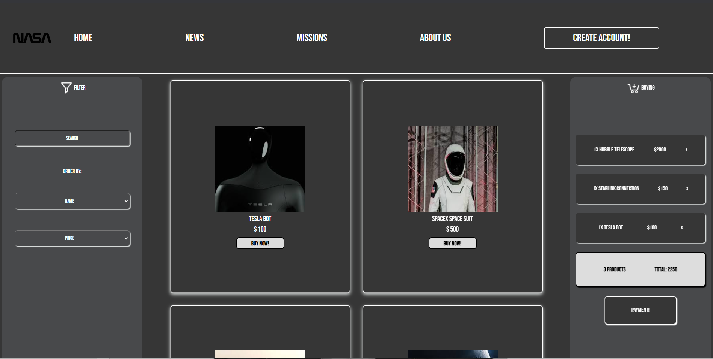

# NASA E-Commerce

This project simulate perfectly an E-Commerce Website where, trought React Applications, the user can buy spacial items, like, space suits, space travels and etc. To produce this application it was used basics and advanced React content including many tools and librarys; styled-components, useState, useEffect, React Router and others.

- JSX
- Components
- Props
- States
- React Data Flow
- Array rendering
- Conditional Rendering
- localStorage
- React Router
- useEffects
- Styled-components

## 📄 Description
1. Home Page
    - The Main page will show a list of all available products for our e-commerce, with the updated data ( images, names and prices ); all of these products can be added to the cart clicking on the button "Buy Now".
    - The left side menu is the Filter Area. All products can be sorted by their names (A-Z/Z-A) or prices (Highest/ Lowest).
    - The right side menu allow the user to see all the items that were added to the cart; the bill's amount and the quantity of products. If you want to remove any item from that list is just click on the X button. If you want to proceed with the shopping, you can click on the "Payment" button that will take you to the payment page.
    - Using LocalStorage all products are saved; so if the user need to refresh the page, won't loose the cart.
    - At the top of the page, on the right side; the users can create their own account by clicking on "Create Account" button, this will take them to the LoginPage.

2. LoginPage
    - At the login page we can see the traditional inputs to create new accounts; we can see that are 5 inputs, each one for a data that the user has to complete (name, email, password and username).
    - All the inputs are being controlled by the handle functions and can be moved to a BackEnd interface easily.
    - All the inputs have their own requirements like, minimum length for usernames, same password and etc.

3. Payment Page 
    - At the Payment Page, a perfect simulation of a credit card registration. Where the user will fill the inputs with the credit card information and finalize the purchase.
    - All the inputs are being controlled by the handle functions and can be moved to a BackEnd interface easily.

    ## ⚒️ Technologies

## 📫 Reach me

E-mail: lucascalabria86@gmail.com

